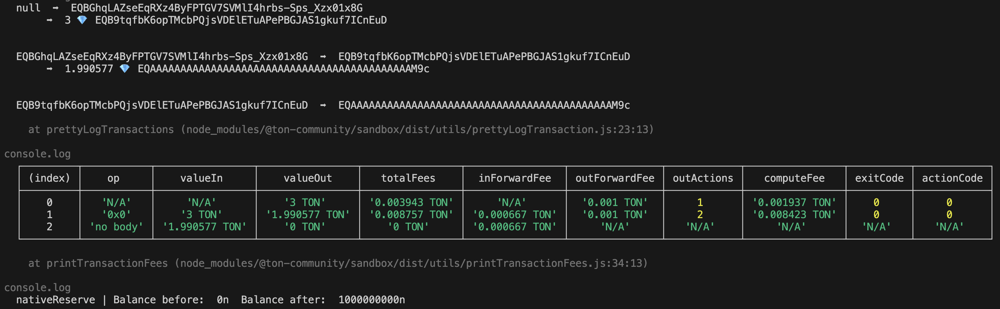
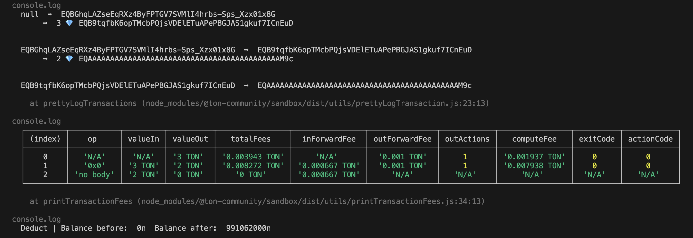

# Native Reserve v.s. Directly dwindle from Context

The purpose of these two functions is to maintain approximately 1 TON within the contract. To sum up, `NativeReserve` offers greater precision but incurs a higher gas cost.

- Native Reserve 
  - total gas: **0.003943 + 0.008757 = 0.0127  (expensive)**
  - remain ton: 1 TON
  
    

- Directly dwindle from context 
  - (total gas: 0.003943+0.008272=**0.012215 (cheap)**)
  - remain ton: 0.991 TON
  
    

## Project structure

-   `contracts` - source code of all the smart contracts of the project and their dependencies.
-   `wrappers` - wrapper classes (implementing `Contract` from ton-core) for the contracts, including any [de]serialization primitives and compilation functions.
-   `tests` - tests for the contracts.
-   `scripts` - scripts used by the project, mainly the deployment scripts.

## How to use

### Build

`npx blueprint build` or `yarn blueprint build`

### Test

`npx blueprint test` or `yarn blueprint test`

### Deploy or run another script

`npx blueprint run` or `yarn blueprint run`

### Add a new contract

`npx blueprint create ContractName` or `yarn blueprint create ContractName`
